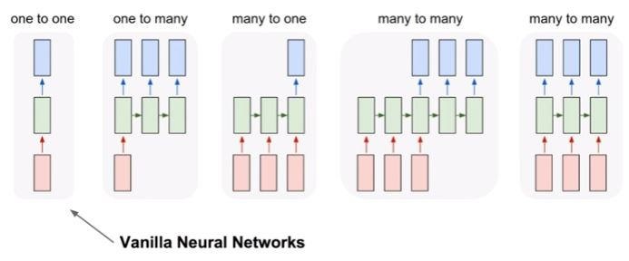

# 190610 DAY10

> 모두를 위한 딥러닝 시즌1 강좌 - Lec12
>
> 모두를 위한 딥러닝 시즌1 강좌 - Lab12-1, 12-2, 12-3, 12-4, 12-5, 12-6

1. **RNN(Recurrent Neural Network)**
   * sequence data를 처리하는 모델
   * RNN에서는 은닉층에서 활성화 함수를 통해 결과를 내보내는 역할을 하는 노드(node)를 셀(cell)이라고 한다.
   * 이 셀은 이전의 값을 기억하려고 하는 일종의 메모리 역할을 수행할 수 있으므로 이를 보통 메모리 셀 또는 RNN 셀이라고 한다.
   * RNN(Recurrent Neural Network)은 일반적으로 step을 거칠 때마다 어떤 결과를 예측하게 된다

2. **RNN 은닉층, 출력층 수식**
   * 은닉층 : ht = tanh(Wxxt +Whht−1 + b)
   * 출력층 : yt = f(Wyht + b)

3. **RNN의 다양한 형태**

   * 하나의 입력에 대해서 여러개의 출력(one-to-many) 모델
     * 하나의 사진 이미지 입력에 대해서 사진의 제목을 출력을 내놓는 이미지 캡셔닝(Image Captioning) 작업에 사용할 수 있을 것이다.
   * 다수의 입력에 대해서 하나의 출력(many-to-one) 모델
     * 입력 데이터으로부터 긍정적 감성인지 부정적 감성인지를 판별하는 감성 분류(Sentiment Classification), 또는 입력 데이터가 어떤 종류의 문서인지를 판별하는 문서 분류(Document Classification)에 사용할 수 있다.
   * RNN의 대표적인 용도인 다 대 다(many-to-many) 모델
     * 입력 문장으로 부터 대답을 출력하는 챗봇과 입력 문장으로부터 번역된 문장을 출력하는 번역기에 사용할 수 있다.

   