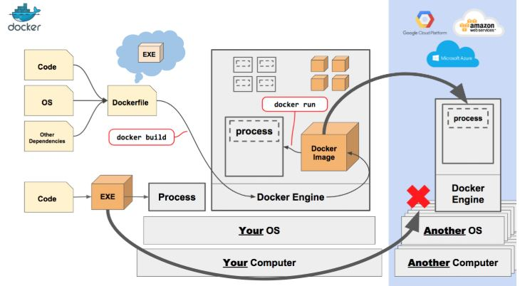
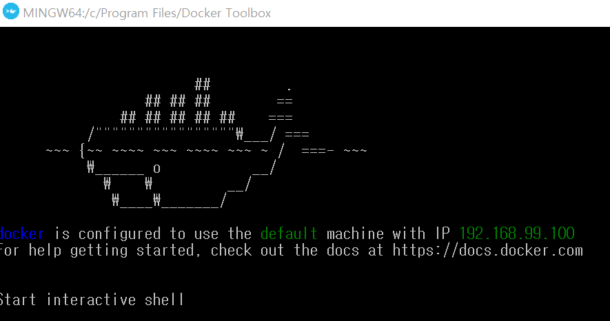
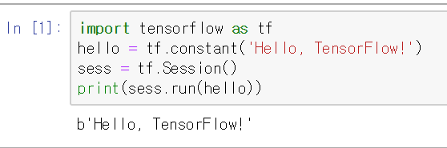

# 190528 Day2

> Docker 설치
>
> tensorflow 설치
>
> jupyter notebook 설치

##  docker

* docker 란?

  * 컨테이너 기반의 오픈소스 가상화 플랫폼
  * 컨테이너의 리소스, 파일 시스템, 네트워크를 기존 시스템과 격리시키고 도커 이미지를 관리하고 공유하는 기능을 제공

  

## docker 설치

## tensorflow / jupyter notebook 설치

