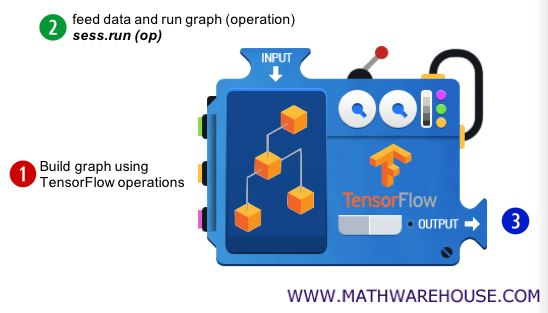

# 190528 Day2

> Docker 설치
>
> tensorflow 설치 / tensorflow 실행
>
> jupyter notebook 설치 / jupyter notebook 사용
>
> 모두를 위한 딥러닝 시즌1 강좌 - Lab01


##  docker

* **Docker 란?**

  * 컨테이너에 여러 기능을 추가함으로 애플리케이션을 컨테이너로서 쉽게 사용할 수 있게 만들어진 오픈소스이다.
  * 컨테이너의 리소스, 파일 시스템, 네트워크를 기존 시스템과 격리시키고 도커 이미지를 관리하고 공유하는 기능을 제공한다.
    * 컨테이너: 컨테이너는 하드웨어 가상화가 아니라 OS에서 지원하는 기능을 사용하고 격리된 환경에서 프로세스를 실행하는 것을 의미한다. 컨테이너는 프로세스일 뿐이며 각각의 컨테이너는 서로 다른 환경을 가지고 있다. 

  

* **Docker 이미지**
  * 이미지는 컨테이너 실행에 필요한 파일과 설정값 등을 포함하고 이쓴 것으로 상태값을 가지지 않고 변하지 않는다. 
  * 컨테이너는 이미지를 실행한 상태라고 볼 수 있고 추가되거나 변하는 값은 컨테이너에 저장된다.
  * 같은 이미지에서 여러개의 컨테이를 생성할 수 있고, 컨테이너의 상태가 바뀌거나 컨테이너가 삭제되더라도 이미지는 변하지 않고 그대로 남아있다.


## docker 설치

> window 7 이상
>
> python 64bit이어야 한다. (tensorflow 설치를 위해)
>
> docker 홈페이지에서 Docker for Windows 다운로드


* **Docker 설치 완료**


## tensorflow / jupyter notebook 설치

> `pip install tensorflow`
>
>  `pip install jupyter `


* 설치한 tensorflow / jupyter notebook 실행


## TensorFlow 실행

* **version 확인하기**

  ```python
  >>> import tensorflow as tf
  >>> tf.__version__
  '1.1.0-rc1'
  ```


* **Hello, TensorFlow! 출력하기**

  * constant() 함수를 사용해서 점만 1개 있는 그래프를 만든다.
  * 선은 없으며, "Hello, TensorFlow!"라는 상수만 있는 연산 그래프이다.
  * 그래프를 실행하기 위해서는 1) 세션을 만든다. 2) run()함수를 사용하여 만들어 놓은 연산(점)을 실행한다.
  * 결과에서  'Hello, TensorFlow!' 문자열 앞에 있는 b는 바이트 문자열(Bytes literals)을 의미한다.

  ```python
  # constant() 함수로 상수만 있는 연산을 하나 만든다.
  # 이 연산은 기본 텐서플로우 그래프에 점(node)으로 추가가 된다.
  >>> hello = tf.constant("Hello, TensorFlow!")
  
  # 텐서플로우 세션을 시작한다.
  >>> sess = tf.Session()
  
  # 연산을 수행하고 결과를 얻는다.
  >>> print(sess.run(hello))
  b'Hello, TensorFlow!'
  ```


* **2개의 데이터를 받아 더하는 그래프 만들기**

  > a+b 값을 더하는 그래프를 만든다.

  1. 2개의 입력을 위하여 constant() 함수로 데이터 입력용 연산을 위한 점을 만든다.
  2. 더하기 연산을 위하여 add() 함수로 더하기 연산 점을 만든다.
  3. 세션을 만든다.
  4. run() 함수로 그래프 연산을 한다. 

  ```python
  >>> node1 = tf.constant(3.0, tf.float32)
  >>> node2 = tf.constant(4.0)  # 암묵적으로 tf.float32로 인식한다.
  >>> node3 = tf.add(node1, node2) 
  
  >>> print("점1 = ", node1, "점2 = ", node2)
  점1 =  Tensor("Const_4:0", shape=(), dtype=float32) 점2 =  Tensor("Const_5:0", shape=(), dtype=float32)
  # 점1과 점2는 모두 Tensor이다.
  
  >>> print("점3 = ", node3)
  점3 =  Tensor("Add:0", shape=(), dtype=float32)
  # 점3도 Tensor이다.
  >>> sess = tf.Session()
  
  >>> print("sess.run(점1, 점2) = ", sess.run([node1, node2]))
  sess.run(점1, 점2) =  [3.0, 4.0]
  
  >>> print("sess.run(점3) = ", sess.run(node3))
  sess.run(점3) =  7.0
  
  >>> node4 = node1 + node2   # 'node4 = node1 + node2'라고 해도 된다.
  >>> print("sess.run(점4) = ", sess.run(node4))
  sess.run(점4) =  7.0
  ```


* **TensorFlow의 역학구조**

  1. TensorFlow의 연산을 사용하여 그래프를 만든다.
  2. Session() 함수로 세션을 만들고, sess.run() 함수에 데이터를 주고 계산 그래프를 실행하여 연산을 한다.
  3. 결과값이 나와 그래프에 있는 변수들이 업데이트 된다.

  