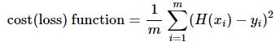

# 190529 Day3

> 모두를 위한 딥러닝 시즌1 Lec02, 03, 04 강좌 학습
>
> 모두를 위한 딥러닝 시즌1 Lab02, 03, 04-1, 04-2 학습


## Linear Regression

* **x** : 예측을 하기 위한 기본적인 자료,  training data 또는 learning data 또는 feature
* **y** : 예측하려는 값
* **regression** : 0~100 사이의 값을 예측하는 것
* **training** : 데이터로 학습을 시키는 것


## Linear Regression 모델 만들기

* **Linear Regression 모델을 만들기 위해서는 가설(hypothesis)을 세울 필요가 있다.**
  * 가설(Hypothesis) 세우기 
  * 학습(learning) 하기


1. **H(w) = Wx + b** : Linear Regression 직선을 표현하는 수학식
   * H(w) : 가설, 예측 값
   * W: weight
   * b: bias
   * W와 b에 따라 여러 가지 직선이 만들어질 수 있다.


2. 여러 직선 중 데이터에 가장 잘 맞는 직선을 찾는다.
   * 가설로 세운 직선 위의 점과 실제 데이터와의 거리가 짧으면 좋고, 멀면 나쁘다.
   * 그래서 직선과 실제 데이터와의 거리를 구한다.


3. 거리 구하기

   * **Cost Function**(= Loss Function) : 거리를 구하는 함수

     * 우리가 세운 가설이 실제 데이터가 얼마나 다른가를 알 수 있다

     

* #### Linear Regression 학습의 목표

  * cost(loss) 함수의 값이 최소가 되는 W와 b를 찾는다.


```python
import tensorflow as tf

# 학습용 X와 Y 데이터를 준다.
x_train = [1, 2, 3]
y_train = [1, 2, 3]

# TensorFlow 연산에서는 weight와 bias를 variable로 정
W = tf.Variable(tf.random_normal([1]), name = 'weight')
b = tf.Variable(tf.random_normal([1]), name = 'bias')

# 예측값 함수(hypothesis)
hypothesis = W * x_train + b

# cost(loss) 함수
cost = tf.reduce_mean(tf.square(hypothesis - y_train))

# GradientDescentOptimizer() 함수로 학습에 Gradient Descent 최적화 방법을 사용
optimizer = tf.train.GradientDescentOptimizer(learning_rate=0.01)
train = optimizer.minimize(cost)

# 세션을 만든다.
sess = tf.Session()
# 그래프에 있는 모든 전역 변수를 초기화한다.
sess.run(tf.global_variables_initializer())


for step in range(20001):
    sess.run(train)
    if step % 2000 == 0:
        # sess.run(train) 실행을 통해 그래프 상의 모든 연산이 수행되어
        # 그래프 상의 변수의 값들이 업데이트된다.
        print(f"STEP = {step:>5}, cost = {sess.run(cost):>.10}, "
              f"weight = {sess.run(W)}, bias = {sess.run(b)}")
```

