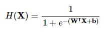
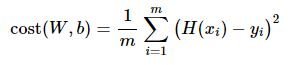
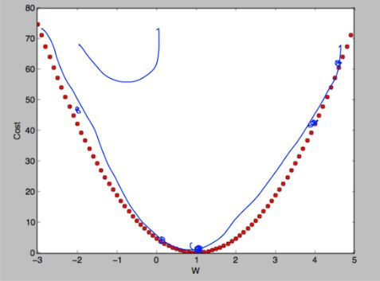
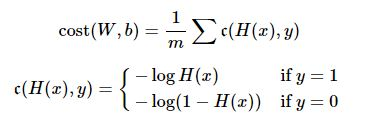
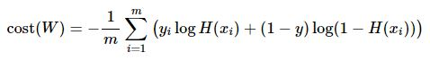
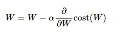

# 190530 Day4

> 모두를 위한 딥러닝 시즌1 - Lec05-1, Lec05-2
>
> 모두를 위한 딥러닝 시즌1 - Lab05


## Logistic Regression Classification (로지스틱 회귀 분류)

* **로지스틱 회귀를 이요한 대상 분류 방법**
  * 분류 알고리즘(classification algorithm) 중에서 굉장히 정확도가 높은 모델로 알려져 있음
    * 바로 실제 문제에 적용이 가능
    * 뉴럴 네트워크와 딥 러닝의 중요한 요소임


* **분류(Classification) 문제**
  * 스팸 메일 탐지(spam mail detection) : 스팸(spam) 또는 정상(ham)
  * 페이스북 피드(facebook feed) : 친구들이 작성한 글을 타임라인에서 보여주기(show) 또는 감추기(hide)
    * 이전에 좋아요를 눌렀던 글을 참고로 해서 보여줄지 말지를 결정
  * 신용카드 비정상 거래 탐지(credit card fraudulent transaction detection) : 정상 거래(legitimate) 또는 비정상 거래(fraud)
    * 이전에 사용했던 거래내역들의 형태를 보고 탐지


* 분류(Classification) 문제를 기계적으로 학습시키기
  * 분류 문제를 기계적으로 학습시키기 위해서는 분류 대상(category)을 '0'과 '1'으로 인코딩한다.
    * 스팸(1) 또는 정상(0)
    * 보여주기(1) 또는 감추기(0)
    * 정상 거래(0) 또는 비정상 거래(1)


## 로지스틱 회귀 분류 모델

* **가설식(Hypothesis)**

  

* **cost(loss) 함수**

  * 선형 모델 $H(x)=Wx+b$일 때의 cost(loss) 함수는

    

  * 이를 그래프로 표현하면 아래 그림과 같다.

    

  * 그러나 로지스틱 회귀 분류 모델에서는 sigmoid 함수를 사용하기 때문에 가설식이 식 (2)처럼 된다. cost(loss) 함수의 그래프를 구불구불하게 그려진다. 

    * 선형 모델에서는 어느 점에서 시작하던지 경사 하강법으로 최저점에 도달할 수 있다.
    * 로지스틱 모델에서는 시작하는 점에 따라서 극소점이 달라지기 때문에 최저점에 도달하는 것이 어렵다. 그래서 cost(loss) 함수도 변형해야만 한다.

  * 그러므로 로지스틱 회귀 분류 모델의 cost(loss) 함수 식은 다음과 같다.

    

    

* **경사 하강법(Gradient Descent Algorithm)**

  * cost(loss) 함수 식의 최소값을 구하기 위해 경사 하강법을 사용한다.

  * 기울기를 구하기 위해

    

    위의 식을 미분한다.

    

  * code

    ```python 
    import tensorflow as tf
    
    # cost(loss) 함수
    cost = -tf.reduce_mean(Y*tf.log(hypothesis) + (1-Y)*tf.log(1-hypothesis))
    
    # 경사 하강법
    a = tf.Variable(0.1) # learning rate = alpha
    optimizer = tf.train.GradientDescentOptimizer(a)
    train = optimizer.minimize(cost)
    ```
