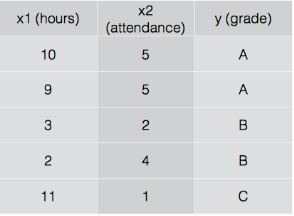

# 190531 Day5

> 모두를 위한 딥러닝 시즌1 강좌 - Lec6-1, 6-2
>
> 모두를 위한 딥러닝 시즌1 강좌 - Lab6-1, 6-2

## 다변수 분류(Multinomial classification)

* **다변수 분류**

  * 다변수라는 것은 3개 이상으로 분류할 수 있는 데이터가 있다는 것이다.

  * 예를 들어, 아래 그림과 같이 공부한 시간($x_1$)과 수업에 참석한 횟수($x_2$)에 따라 3종류의 학점($y$)를 준다고 가정하고 그래프로 표시하면 아래와 같다.

    

  * 이진 분류(binary classification)만 가지고도 다변수 데이터를 분류할 수 있다.

    * A이거나 A가 아니거나
    * B이거나 B가 아니거나
    * C이거나 C가 아니거나

## SOFTMAX  함수

* n개의 값을 softmax 함수에 넣으면 우리가 원하는 2개의 조건을 만족하는 값을 만들어줘 확률로 볼 수 있게 해준다.
  * 각각의 값 y_i는 0\leqslant y_i \leqslant 1을 만족한다.
  * \sum_i y_i =1