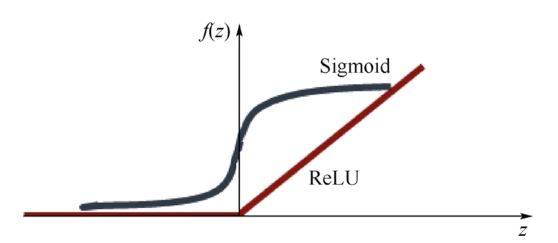

# Deep Learning 정리

1. **softmax** 
   * 데이터를 2개 이상의 그룹으로 나누기 위해서 binary classification을 확장한 모델이다.
   * 새로운 조건으로 가장 큰 값을 찾는 개념
   * 일반적으로는 큰 숫자를 찾는 것이 hardmax에 해당하고, 숫자를 거꾸로 뒤집었을 경우에 대해 가장 큰 숫자를 찾는 것이 softmax이다.
   * binary classification을 여러번 결합한 결과.
   * softmax의 역할
     * 입력을 sigmoid와 마찬가지로 0과 1사이의 값으로 변환한다.
     * 변환된 결과에 대한 합계가 1이 되도록 만들어 준다.
   * one-hot encoding은 softmax로 구한 값 중에서 가장 큰 값을 1로, 나머지는 0으로 만든다.
     * tensorflow에서 argmax함수라는 이름으로 제공하고 있다.

2. **sigmoid**
   * 선형인 멀티퍼셉트론에서 비선형 값을 얻기 위해 사용한다.
   * logistic classification에서 어디에 속하는지 분류를 하기 위해 사용한다. 일정 값을 넘어야 성공하는 참(True)이 될 수 있기 때문에 Activation function이라고도 부른다.
   * sigmoid의 특징
     * 함수값이 (0, 1)로 제한된다.
     * 중간 값은 1/2이다.
     * 매우 큰 값을 가지면 함수값은 거의 1이며, 매우 작은 값을 가지면 거의 0이다.
   * sigmoid의 단점
     * Gradient Vanishing 현상이 발생한다. 미분함수에 대해 x=0에서 최대값 1/4을 가지고, input값이 일정 이상 올라가면 미분값이 거의 0에 수렴하게 된다. 이는 |x| 값이 커질 수록 Gradient Backpropergation시 미분값이 소실될 가능성이 크다.
     * 함수값 중심이 0이 아니다. 함수값 중심이 0이 아니라 학습이 느려질 수 있다.
     * exp 함수 사용시 비용이 크다.

3. **ReLU**
   * 0보다 작을 때는 0을 사용하고, 0보다 큰 값에 대해서는 해당 값을 그대로 사용하는 방법이다.
     * 음수에 대해서는 값이 바뀌지만, 양수에 대해서는 값을 바꾸지 않는다.
   * backpropagation에서 layer를 따라 진행할수록 값이 사라지는 현상은 ReLU를 통해 해결할 수 있다.

4. **Weight**
   * 전체 초기값을 0으로 주어서는 안되며, 적절하게 wieght를 초기화 해야한다.

5. **RBM(Resticted Boltzmann Machine)**

   * graphical probabilistic model의 일종으로, undirected graph로 표현되는 모델이다.

6. **overfitting**

   * 우리의 목적은 training set과 완벽하게 똑같은 모델을 만드는 게 아니라 training set에 없는 새로운 데이터에 대해서 target을 정확하게 예측하는 것이다. 그러나 training data에 지나치게 맞춰진 모델은 오히려 새로운 데이터를 예측하는 데에는 실패할 수 있다. 이와같이 training data에 지나치게(over) fit 되어 일반적인 추세를 표현하지 못하는 문제를 overfitting이라고 한다.

7. **Regularizaion**

   * 모든 feature를 유지하되, parameter θjθj 의 크기를 작게 유지한다.
   * 많은 feature가 yy를 예측하는 데에 조금씩 기여하는 경우 유용하다.

8. **CNN**

- - 각 레이어의 입출력 데이터의 형상 유지
  - 이미지의 공간 정보를 유지하면서 인접 이미지와의 특징을 효과적으로 인식
  - 복수의 필터로 이미지의 특징 추출 및 학습
  - 추출한 이미지의 특징을 모으고 강화하는 Pooling 레이어
  - 터를 공유 파라미터로 사용하기 때문에, 일반 인공 신경망과 비교하여 학습 파라미터가 매우 적음

9. **ConvNet**

- - ConvNet은 학습 가능한 가중치 (weight)와 바이어스(bias)로 구성되어 있다
  -  ConvNet 아키텍쳐는 입력 데이터가 이미지라는 가정 덕분에 이미지 데이터가 갖는 특성들을 인코딩 할 수 있다.
  - 이러한 아키텍쳐는 포워드 함수 (forward function)을 더욱 효과적으로 구현할 수 있고 네트워크를 학습시키는데 필요한 모수 (parameter)의 수를 크게 줄일 수 있게 해준다.

10. **Pooling**

- - 어떤 작업을 하건 pooling을 거치면 크기가 작아진다는 것이 핵심

  - Max Pooling (pooling 기법 중 가장 많이 사용하는 법)

  - - 여러 개의 값 중에서 가장 큰 값을 꺼내서 모아 놓는 것을 뜻한다.
    - pooling에서는 단순하게 존재하는 값 중에서 하나를 선택한다
    - pooling에는 최소값을 선택하거나 평균이나 표준편차를 계산하는 등의 다양한 방법들이 있고, CNN에서는 가장 큰 값을 선택하는 Max Pooling을 주로 사용한다

