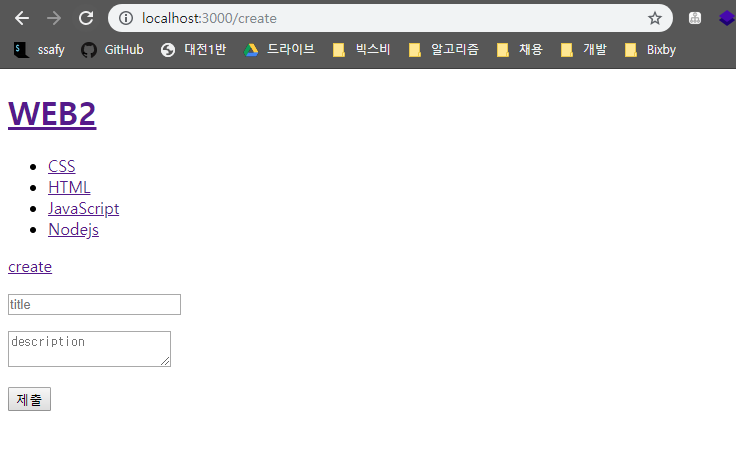
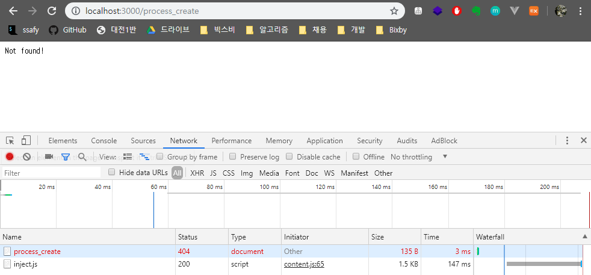
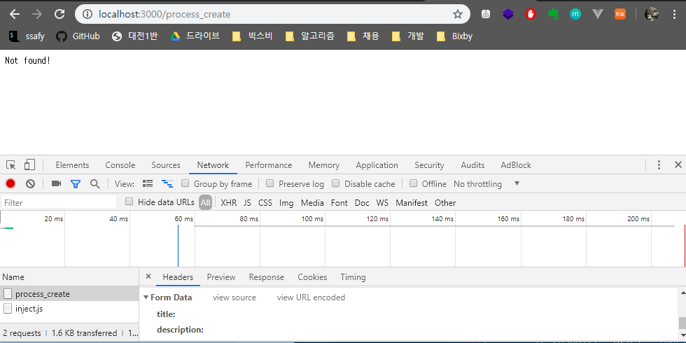

# 글 생성 UI 만들기

> 애플리케이션의 글 쓰기 화면을 만들어보자


#### 1. 사용자가 `localhost:3000/create` 주소를 요청했경우 입력폼이 출력된다.

```javascript
var app = http.createServer(function(request, response) {
    var _url = request.url;
    var queryData = url.parse(_url, true).query;
    var pathname = url.parse(_url,true).pathname;
    
    // 1. pathname이 '/'인 경우
    // => 사용자가 query string만을 이용해서 상세 페이지를 요청한 경우
    if (pathname ==='/') {
        ...
    
    }
    // 2. pathname이 '/create'인 경우
    // => 사용자가 localhost:3000/create라는 주소로 글쓰기 화면을 요청한 경우
    else if (pathname ==='/create') {
      fs.readdir('./data', function(error, fileList) {
        var title = 'WEB - create';
        var list = templateList(fileList);
        var template = templateHTML(title, list, `
          <form action="http://localhost:3000/process_create" method="POST">
            <p>
              <input type="text" name="title" placeholder="title">
            </p>
            <p>
              <textarea name="description" placeholder="description"></textarea>
            </p>
            <p>
              <input type="submit">
            </p>
          </form>
        `);
        response.writeHead(200);
        response.end(template);
      });
    }
    // 3. 서버에서 존재하지 않는 pathname을 요청한 경우
    else {
        
    }
})
```


#### 2. 출력결과를 확인하자



#### 3. 제출 버튼 누른 뒤 '검사'해보자

- Network 탭으로 가서 확인해보자.
- 제출 버튼을 클릭하면 입력값들이 `/process_create`라는 주소로 보내지게끔 짜여져 있는데,
  지금은 `/process_create` 페이지를 처리해주지 않았기 때문에 Status란에 404 Not Found가 뜨고있다.
  


#### 4. 폼 양식을 통해 넘어온 데이터 정보를 확인해보자

* `process_create 클릭` → `Headers` → `Form Data`

* 폼 양식을 통해 title과 description 내용이 은밀하게 넘어와있는 것을 확인할 수 있다.

  

