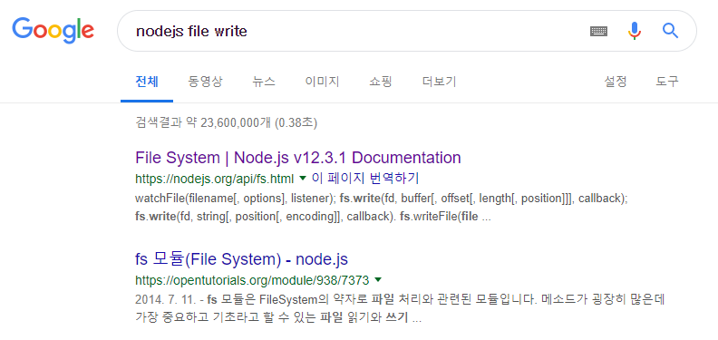
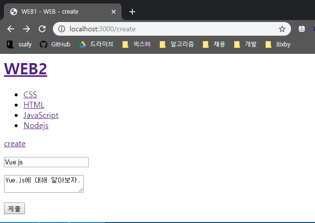
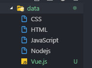
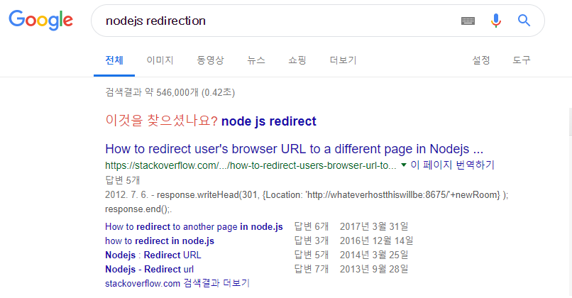

# 파일생성과 리다이렉션

> 전송된 POST 데이터를 받아서 파일에 저장하고, 그 결과를 리다이렉션하는 방법




#### 1. writeFile() 메소드를 사용해서 파일을 저장하자.

```javascript
request.on('end', function() {
    var post = qs.parse(body);
    var title = post.title;
    var description = post.description;

    // writeFile(파일의 경로 및 이름, 파일에 들어갈 내용(데이터),
    //           인코딩 방식, 콜백함수)
    fs.writeFile(`data/${title}`, description, 'utf8', function(err) {
        response.writeHead(200);
        response.end('Success');
    });
```


#### 2. 폼 입력을 통해 결과물 확인해보자





* Vue.js를 타이틀으로 하는 파일이 정상적으로 생성된 것을 확인할 수 있다.


#### 3. 파일 생성이 완료되면 사용자를 List 페이지로 보내자 (`/?id=Vuejs`)

* **redirect**는 어떻게 하는지 구글링을 해볼까요?

  

* 코드를 수정해보자

  ```javascript
  fs.writeFile(`data/${title}`, description, 'utf8', function(err) {
      // 302: 페이지를 다른 페이지로 redirection 시켜라.
      response.writeHead(302, {Location: `/?id=${title}`});
      response.end();
  ```

