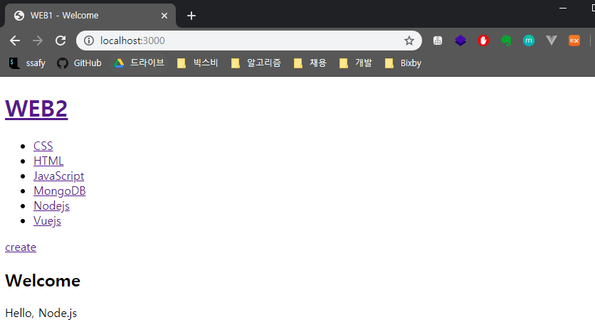
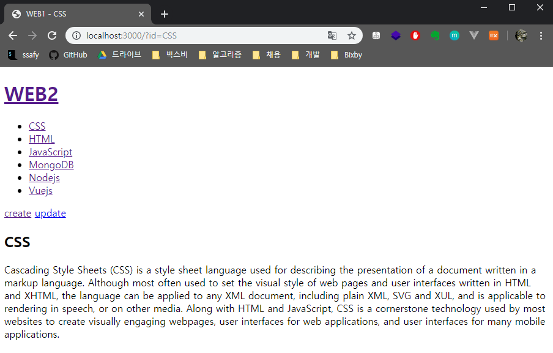
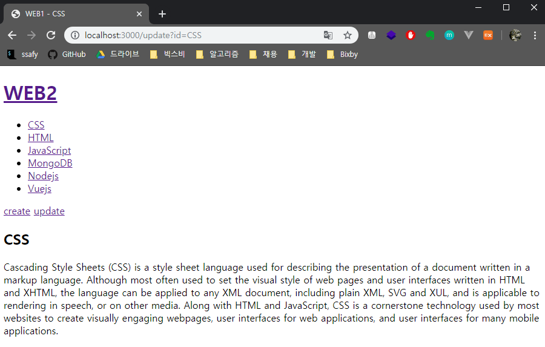
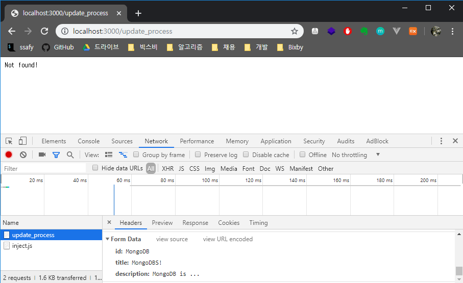
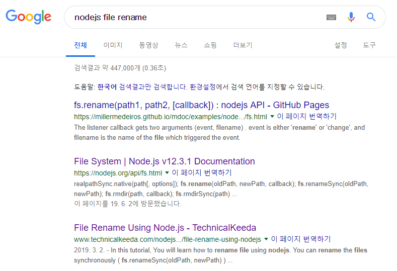

# 글 수정기능 구현

> update 기능을 구현해보자

* 목차
  1. 글 수정 링크 생성하기
  2. 수정하고 싶은 글 정보 전송하기
  3. 수정된 내용 저장하기


## 1. 글 수정 링크 생성

#### 1. templateHTML 함수의 코드를 수정하자. control이라는 인자로 내용을 받는다.

```javascript
function templateHTML(title, list, body, control) {
  return `
  <!doctype html>
  <html>
  <head>
    <title>WEB1 - ${title}</title>
    <meta charset="utf-8">
  </head>
  <body>
    <h1><a href="/">WEB2</a></h1>
    ${list}
    ${control}
    ${body}
  </body>
  </html>
  `;
}
```


#### 2. 홈 화면에선 update 태그가 나오지 않아도 되므로 create 태그만 입력해준다.

* 소스코드

  ```javascript
  if (pathname === '/') {
      // 홈 화면이든 상세 페이지든 바로가기 링크는 필요하므로,
      // 일단 fileList를 읽어오고나서 본문 내용을 구성해보자.
      fs.readdir('./data', function(error, fileList) {
          // 2-1. 홈 화면을 요청했을 경우
          if (queryData.id === undefined) {
              var title = 'Welcome';
              var description = 'Hello, Node.js';
              var list = templateList(fileList);
              var template = templateHTML(title, list,
                                          `<h2>${title}</h2>${description}`,
                                          `<a href="/create">create</a>`
                                         );
              response.writeHead(200);
              response.end(template);
  ```

* 출력결과

  

#### 3. 상세 페이지 화면에선 update 태그도 함께 출력한다.

* 소스코드

  ```javascript
  } else {
          fs.readFile(`data/${queryData.id}`, 'utf-8', function(err, description) {
            var title = queryData.id;
            var list = templateList(fileList);
            var template = templateHTML(title, list,
                                         `<h2>${title}</h2>${description}`,
                                         `<a href="/create">create</a>
                                          <a href="/update?id=${title}">update</a>`
                                       );
            response.writeHead(200);
            response.end(template);
          });
        }
  ```

* 출력물

  


## 2. 수정하고싶은 글 정보 전송

#### 2-1. 수정하고자 하는 글의 정보를 읽어오자

* 소스코드

  ```javascript
  } else if(pathname ==='/update') {
      fs.readdir('./data', function(error, fileList) {
        fs.readFile(`data/${queryData.id}`, 'utf8', function(err, description) {
          var title = queryData.id;
          var list = templateList(fileList);
          var template = templateHTML(title, list,
            `<h2>${title}</h2>${description}`,
            `<a href="/create">create</a> <a href="/update?id=${title}">update</a>`
          );
          response.writeHead(200);
          response.end(template);
        });
      });
    }
  ```

* 출력결과

  * id값에 해당하는 페이지의 글 내용이 정상적으로 출력된 것을 확인할 수 있다.

  

#### 2-2. 글 내용을 지우고, 그 자리에 form 양식을 넣어보자

* 우리는 현재 title의 이름을 기준으로,
  data 폴더에서 해당하는 title 이름을 찾아서 정보를 불러오고 있다.

* 만약 form에서 사용자가 title 이름을 수정해서 submit 해버린다면
  해당하는 title 이름을 폴더에서 찾을 수 없기 때문에 문제가 발생할 것이다.

* 따라서 HTML input 태그의 hidden 이라는 type을 활용해서
  기존의 title 값도 함께 전송해줄 것이다. 

  * 넘어온 Form Data를 보면 수정하고자 하는 id값인 MongoDB와,
    사용자가 바꾸고자 하는 title 값이 함께 넘어온 것을 확인할 수 있다.
    

  

## 3. 수정된 내용 저장

#### 3-1. `/create_process`의 코드를 갖고와서 내용을 찍어보자

* 소스코드

  ```javascript
  } else if(pathname === '/update_process') {
      var body = '';
  
      request.on('data', function(data) {
        body += data;
      });
      request.on('end', function() {
        var post = qs.parse(body);
        var id = post.id;
        var title = post.title;
        var description = post.description;
        console.log(post);
  
        /*
        fs.writeFile(`data/${title}`, description, 'utf8', function(err) {
          response.writeHead(302, {Location: `/?id=${title}`});
          response.end();
        });
        */
      });
    }
  ```

* 출력결과

  ```
  0|main     |   id: 'MongoDB',
  0|main     |   title: 'MongoDBS!',
  0|main     |   description: 'MongoDB is ...' }
  ```


#### 3-2. 기존 파일의 이름을 바꾸려면 어떻게 해야할까?

* 일단 구글링 해보자구.
  

* **rename() 메소드를 사용해서 파일 이름과 파일 내용을 수정해보자**

  * 소스코드

    ```javascript
    } else if(pathname === '/update_process') {
        var body = '';
    
        request.on('data', function(data) {
          body += data;
        });
        request.on('end', function() {
          var post = qs.parse(body);
          var id = post.id;
          var title = post.title;
          var description = post.description;
            
          // 1. 파일 이름 수정
          fs.rename(`data/${id}`, `data/${title}`, function(error) {
            // 2. 파일 내용 수정
            fs.writeFile(`data/${title}`, description, 'utf8', function(err) {
              response.writeHead(302, {Location: `/?id=${title}`});
              response.end();
            });
          });
        });
      }
    ```