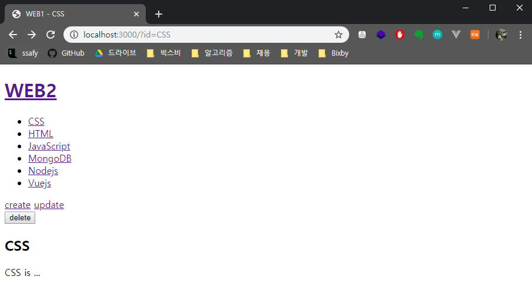
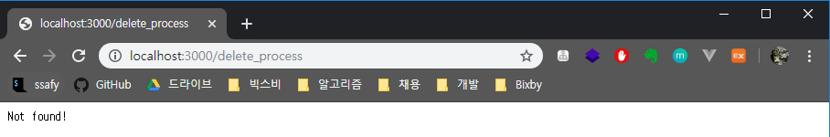
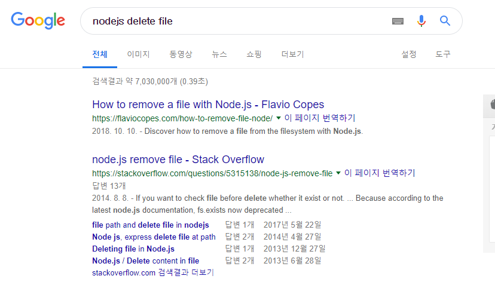

# 글 삭제기능 구현

* 목차
  1. 삭제 버튼 구현
  2. 삭제 기능 완성


## 1. 삭제 버튼 구현

> 삭제 작업을 하기 위해선 삭제 버튼이 있어야 한다. 이 때 링크를 사용해서 GET 방식으로 구현하면 안된다!
> 링크 대신 form을 이용해서 POST 방식으로 삭제 버튼을 만들자!

#### 소스코드

```javascript
} else {
    fs.readFile(`data/${queryData.id}`, 'utf-8', function(err, description) {
        var title = queryData.id;
        var list = templateList(fileList);
        var template = templateHTML(title, list,
                                    `<h2>${title}</h2>${description}`,
                                    `<a href="/create">create</a>
                                     <a href="/update?id=${title}">update</a>
                                     <form action="/delete_process" method="POST">
                                       <input type="hidden" name="id" value="${title}">
                                       <input type="submit" value="delete">
                                     </form>
									`
                                   );
        response.writeHead(200);
        response.end(template);
    });
}
```

#### 출력결과






## 2. 글 삭제기능 완성

* 일단 구글링 해보자구

  * `unlink()` 메소드를 써보자

  

#### 소스코드

```javascript
} else if(pathname === '/delete_process') {
    var body = '';

    request.on('data', function(data) {
      body += data;
    });
    request.on('end', function() {
      var post = qs.parse(body);
      var id = post.id;
      // unlink() 메소드를 사용해서 원하는 파일을 삭제하자.
      fs.unlink(`data/${id}`, function(error) {
        // 삭제가 끝나면 홈으로 보내버리자.
        response.writeHead(302, {Location: `/`});
        response.end();
      });
    });
  }
```

