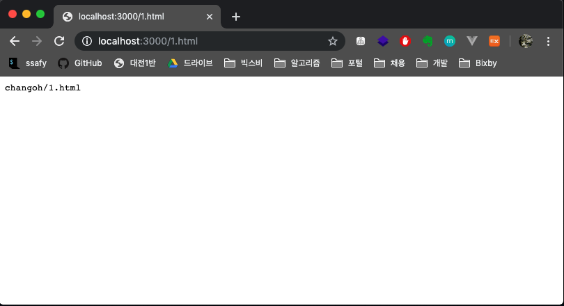
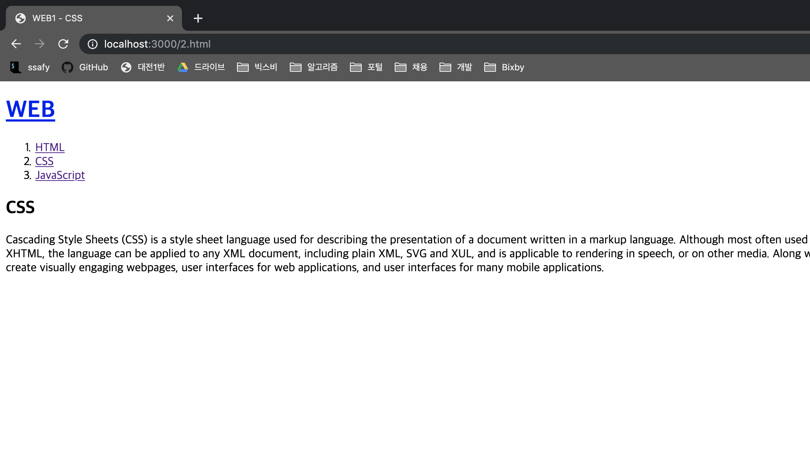

# 설치 및 웹서버 구동

> 수많은 HTML 코드를 수동으로 쳐서 웹페이지를 하나하나 만들어야했음. 이런 불편함을 해소하고, 새로운 컴퓨터 언어를 배우지 않고도 웹페이지를 자동으로 만들 수 있는 서버쪽 애플리케이션을 만들기 위해 태어난 기술이 Node.js임.

> 2008년, 구글이 V8 엔진을 발표. 이를 토대로 Node.js가 개발됨. Javascript를 이용해서 웹 브라우저가 아닌 컴퓨터 자체를 제어할 수 있게 됨. 마치 Python처럼. 이 때문에 웹 브라우저에만 갇혀있던 Javascript가 Hot한 언어로 부각되기 시작함.

> 웹 서버 기능을 내장하고 있기 때문에 Apache와 같은 웹 서버 기능도 할 수 있으며, Apache에서 하지못하는 기능들을 구현할 수 있다.


## 1. Node.js 설치 (MacOS)

> Node.js runtime을 설치한 뒤,
> JavaScript 언어를 통해 Node.js의 필요한 기능을 호출해서 Node.js 애플리케이션을 만들어보자.

### 다운로드

* [공식홈페이지 링크](https://nodejs.org)
* LTS(안정적인 버전-추천) 버전을 다운받아서 쭉쭉 설치하자.

### 설치 확인

```bash
$ node -v
v10.15.3

$ node
>
```


## 2. 웹서버 만들기

> 지금은 이 코드들을 이해할 수 없다. 수업이 끝나면 자유자재로 다룰 수 있을 것이니 지금은 그냥 따라해보자.

### 2-1. main.js

```javascript
var http = require('http');
var fs = require('fs');
var app = http.createServer(function(request,response){
    var url = request.url;
    if(url == '/'){
      url = '/index.html';
    }
    if(url == '/favicon.ico'){
      response.writeHead(404);
      response.end();
      return;
    }
    response.writeHead(200);
    console.log(__dirname + url);
    console.log(__dirname);
    console.log(url);
  
 		// node.js가 어떠한 경로에 있는 파일을 읽어서 그 값을 가져온다.
  	// 그 값을 reponse.end()에 위치시킨다.
    response.end(fs.readFileSync(__dirname + url));
 
});
app.listen(3000);
```

* __dirname + url
  response.end() 메소드 안에 경로를 넣어주면, node.js는 경로에 위치하고 있는 파일에 들어있는 값을 가져온다.

  ```bash
  /Users/yooco/Programming/opentutorials/nodejs/실습코드/index.html
  ```

  * __dirname` : `main.js`가 위치하고 있는 디렉토리 경로

    ```
    /Users/yooco/Programming/opentutorials/nodejs/실습코드
    ```

  - `url` : 사용자가 요청한 주소

    ```
    /index.html
    ```

    

* response.end('changoh' + url);

  괄호 안에 어떤 코드를 넣느냐에 따라 사용자에게 전송하는 데이터가 바뀐다.
  Apache와 같은 웹서버는 할 수 없지만 Node.js, Django, PHP와 같은 녀석들만 할 수 있는 기능이다.

  

### 2-2. terminal

```bash
$ node main.js
/Users/yooco/Programming/nodejs/생활코딩/1.html
/Users/yooco/Programming/nodejs/생활코딩/coding.jpg
/Users/yooco/Programming/nodejs/생활코딩/3.html
/Users/yooco/Programming/nodejs/생활코딩/2.html
```

### 2-3. 출력물

