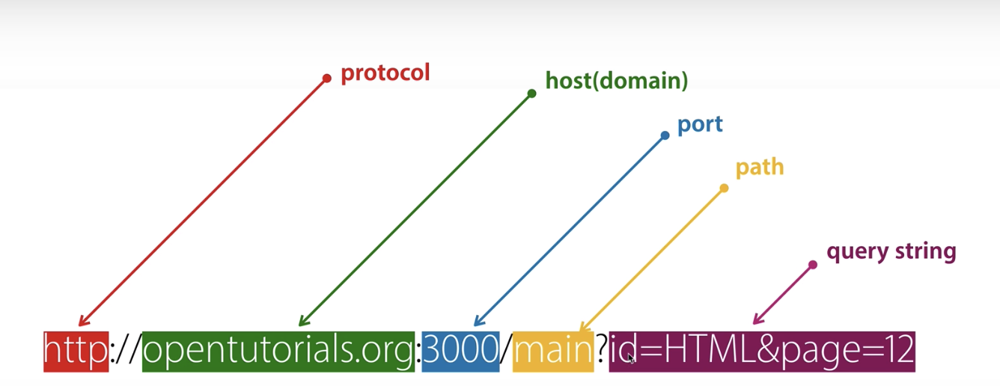
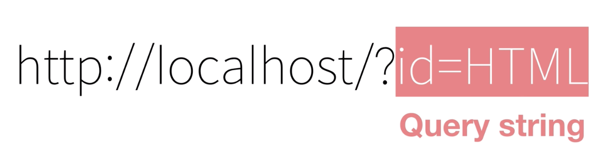
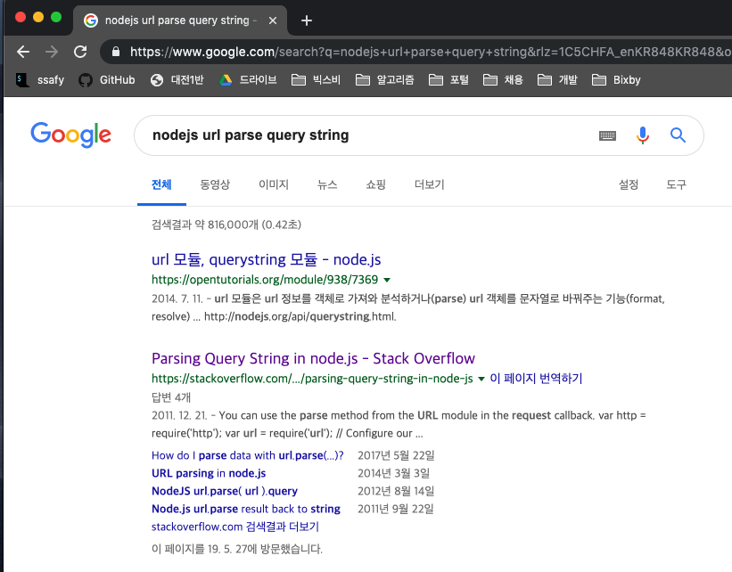
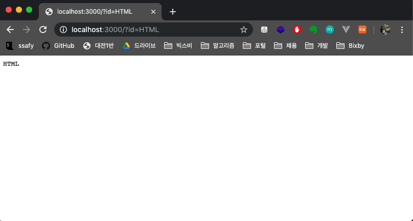

# 1. URL로 입력된 값 사용하기 (Node.js)

> URL에 포함된 쿼리 스트링을 해석해서 이용하는 방법을 알아보자


## 1. URL의 이해

> 자바스크립트를 이용해서 Nodejs가 갖고있는 기능을 호출하여 웹 애플리케이션을 만들어야 한다.
> 웹 애플리케이션을 구현하는 아주 중요한 테크닉인 URL을 다룰 수 있어야 한다.
>
> 지금은 1.html, 2.html, 3.html과 같은 정적인 파일을 불러오고 있다.
> 만약 웹페이지가 1억개면 1억개의 정적 파일을 가지고 있어야 한다.
> 조금더 효율적으로 만들 순 없을까?



* `protocol`
  * 웹 브라우저와 웹 서버가 서로 데이터를 주고받기 위해서 만든 통신규약
* `host(domain)`
  * 인터넷에 연결되어 있는 각각의 컴퓨터를 가리키는 주소
* `port`
  * 한 대의 컴퓨터 안에 여러 대의 서버가 있을 수 있다. 클라이언트가 접속했을 때 어떤 서버와 통신할지 애매해진다.  이 때 3000이라고 적으면 서버측 컴퓨터의 3000번 포트에 연결되어 있는 서버와 통신하게 됨.
  * 포트번호를 생략할 경우 80번으로 접속된다. 기본값이 80이다.
* `path`
  * 컴퓨터 안에 있는 어떤 디렉토리, 어떤 파일인지 가리킨다.
* **`query string`**
  **☆ 수업의 핵심은 이놈이다. 쿼리 스트링에 따라 다른 웹페이지가 출력되게 만들어보자.**
  쿼리 스트링에 넣는 값에 따라 서버측에 해당하는 정보를 요청할 수 있다.
  * 쿼리스트링은 `?`로 시작하기로 약속되어 있다.
  * 값과 값은 `&`로 구분하기로 약속되어 있다.
  * 값의 이름과 값은 `=`로 구분하기로 약속되어 있다.


## 2. URL을 통해서 입력된 값을 사용하는 방법

> `localhost:3000/?id=HTML`, `localhost:3000/?id=CSS` 와 같이 쿼리 스트링(id값)에 따라서 다른 정보를 보여주는 Node.js 애플리케이션을 만들어보자.




```javascript
var http = require('http');
var fs = require('fs');
var app = http.createServer(function(request,response){
    var url = request.url;
    console.log(url)
    // request.url에 사용자가 입력한 주소가 담겨있다.
  	// /?id=HTML
    if(url == '/'){
      url = '/index.html';
    }
    if(url == '/favicon.ico'){
      response.writeHead(404);
      response.end();
      return;
    }
    response.writeHead(200);
    response.end(fs.readFileSync(__dirname + url));
 
});
app.listen(3000);
```


url 안에 들어있는 값을 추출해서 우리가 원하는 값을 얻어낼 수 있다.
url을 분석해서 데이터를 추출해야하는데, 이럴 땐 검색을 해야된다. 검색하는 방법 배우는게 아주 중요함.




* 구글링을 통해 알아낸 파싱 방법을 기반으로 데이터를 분석해보자.
  * var url = require('url');
  * var queryData = url.parse(_url, true).query;

```javascript
var http = require('http');
var fs = require('fs');
var url = require('url');

var app = http.createServer(function(request,response){
    var _url = request.url;
    var queryData = url.parse(_url, true).query;
    console.log(queryData)
    // queryData 안에 어떠한 객체가 들어왔다.
    // [Object: null prototype] { id: 'HTML' }
  	console.log(queryData.id)
  	// HTML
    if(_url == '/'){
      _url = '/index.html';
    }
    if(_url == '/favicon.ico'){
      response.writeHead(404);
      response.end();
      return;
    }
    response.writeHead(200);
    response.end(queryData.id);
 
});
app.listen(3000);
```

* response.end()는 해당하는 값을 불러와서 화면에 출력해주는 메소드였다.
  그럼 여기에 queryData.id 값을 넣으면 어떤 결과물이 나올까?

  

  **query string에 들어오는 값에 따라 다른 결과물을 출력**해주는 애플리케이션을 제작했다.
  엄청난 성과다....... 멈추지 말고 전진해보자.


# 동적인 타이틀 만들기 (App)

> query string에 따라 다른 완성된 웹페이지를 출력해보자.
>
> 1억개의 페이지가 있어도 한 번에 바꿀 수 있으므로 이젠 많은 페이지가 두렵지 않다.

### 소스코드

```javascript
var http = require('http');
var fs = require('fs');
var url = require('url');

var app = http.createServer(function(request,response){
    var _url = request.url;
    var queryData = url.parse(_url, true).query;
  	// queryData : [Object] { 'id': 'CSS' } -> 객체가 들어온다.
  	// queryData.id : CSS -> 문자열이 들어온다.
  	
  	// 현재 queryData.id에는 사용자가 입력한 id값이 들어오고 있다. (ex- HTML, CSS, JavaScript)
  	// 아래 template에서 이 값을 넣어서 동적으로 바꾸게끔 만들건데,
  	// 단순히 queryData.id라고 적으면 무슨 의미인지 알아먹기 힘드므로
  	// 조금더 의미있게끔 만들기 위해 'title'이라는 변수를 지정해서 담아준다.
    var title = queryData.id
    if(_url == '/'){  // home으로 갔을 때 아래 코드를 실행한다.
      title = 'Welcome';
    }
    if(_url == '/favicon.ico'){
      response.writeHead(404);
      response.end();
      return;
    }
    response.writeHead(200);
  
  	// template 이라는 변수에 동적으로 바꾸고자 하는 HTML 코드를 저장한다.
    var template = `
    <!doctype html>
    <html>
    <head>
      <title>WEB1 - ${title}</title>
      <meta charset="utf-8">
    </head>
    <body>
      <h1><a href="/">WEB</a></h1>
      <ol>
        <li><a href="/?id=HTML">HTML</a></li>
        <li><a href="/?id=CSS">CSS</a></li>
        <li><a href="/?id=JavaScript">JavaScript</a></li>
      </ol>
      <h2>${title}</h2>
      <p><a href="https://www.w3.org/TR/html5/" target="_blank" title="html5 speicification">Hypertext Markup Language (HTML)</a> is the standard markup language for <strong>creating <u>web</u> pages</strong> and web applications.Web browsers receive HTML documents from a web server or from local storage and render them into multimedia web pages. HTML describes the structure of a web page semantically and originally included cues for the appearance of the document.
      
      </p><p style="margin-top:45px;">HTML elements are the building blocks of HTML pages. With HTML constructs, images and other objects, such as interactive forms, may be embedded into the rendered page. It provides a means to create structured documents by denoting structural semantics for text such as headings, paragraphs, lists, links, quotes and other items. HTML elements are delineated by tags, written using angle brackets.
      </p>
    </body>
    </html>
    `;
  	
  	// 웹 브라우저 화면에 template 변수에 담긴 소스코드를 출력한다.
    response.end(template);
 
});
app.listen(3000);
```


