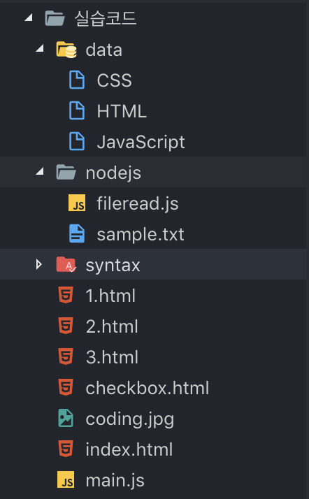

# 1. 파일 읽기 (Node.js)

> Node.js에서 파일을 다루는 방법을 알아보자 :)
> CRUD를 다루는 것이 75%, 나머지 25%를 채우기 위해 어마어마한 수련을 하면 된다.
> 여기선 CRUD를 중점으로 다뤄보자.

* nodejs/실습코드/nodejs/`fileread.js`

  ```javascript
  var fs = require('fs');
  
  fs.readFile('sample.txt', (err, data) => {
    console.log(data);
  });
  ```

* nodejs/실습코드/nodejs/`sample.txt`

  ```
  Hypertext Markup Language (HTML) is the standard markup language for creating web pages and web applications.Web browsers receive HTML documents from a web server or from local storage and render them into multimedia web pages. HTML describes the structure of a web page semantically and originally included cues for the appearance of the document.
  ```

* 터미널에서 자바스크립트 파일을 실행시켜서 값이 잘 들어왔는지 확인해보자!

  * 다음 명령어의 경우엔 node가 상위폴더에서 실행되고 있으므로 fileread.js에 닿지 못한다.

    ```bash
    ~/Programming/opentutorials/nodejs/실습코드
    $ node nodejs/fileread.js
    ```

    ```
    undefined
    ```

  * 다음과 같이 fileread.js 파일이 있는 폴더로 이동해서 실행시키자.

    ```bash
    ~/Programming/opentutorials/nodejs/실습코드
    $ cd nodejs
    ~/Programming/opentutorials/nodejs/실습코드/nodejs
    $ node fileread.js
    ```

    ```
    <Buffer 48 79 70 65 72 74 65 78 74 20 4d 61 72 6b 75 70 20 4c 61 6e 67 75 61 67 65 20 28 48 54 4d 4c 29 20 69 73 20 74 68 65 20 73 74 61 6e 64 61 72 64 20 6d ... >
    ```

  * 아앗...? 텍스트 파일이 깨졌다. 인코딩 문제를 해결하기 위해 코드를 약간 수정한 후 다시 실행하자.

    ```javascript
    var fs = require('fs');
    
    fs.readFile('sample.txt', 'utf8', (err, data) => {
      console.log(data);
    });
    ```

    ```bash
    ~/Programming/opentutorials/nodejs/실습코드/nodejs
    ❯ node fileread.js
    ```

    ```
    Hypertext Markup Language (HTML) is the standard markup language for creating web pages and web applications.Web browsers receive HTML documents from a web server or from local storage and render them into multimedia web pages. HTML describes the structure of a web page semantically and originally included cues for the appearance of the document.
    ```


# 2. 파일을 이용해 본문 구현하기 (App)

> query string 값에 따라 본문이 변경되는 웹 애플리케이션을 만들어보자 :)


#### 1. data 폴더를 생성하고, 동적으로 바뀔 본문만을 따로 빼놓은 파일들을 저장한다.



* data/CSS

  ```
  Cascading Style Sheets (CSS) is a style sheet language used for describing the presentation of a document written in a markup language. Although most often used to set the visual style of web pages and user interfaces written in HTML and XHTML, the language can be applied to any XML document, including plain XML, SVG and XUL, and is applicable to rendering in speech, or on other media. Along with HTML and JavaScript, CSS is a cornerstone technology used by most websites to create visually engaging webpages, user interfaces for web applications, and user interfaces for many mobile applications.
  ```

* data/HTML

  ```
  <a href="https://www.w3.org/TR/html5/" target="_blank" title="html5 speicification">Hypertext Markup Language (HTML)</a> is the standard markup language for <strong>creating <u>web</u> pages</strong> and web applications.Web browsers receive HTML documents from a web server or from local storage and render them into multimedia web pages. HTML describes the structure of a web page semantically and originally included cues for the appearance of the document.
  </p>
  <p style="margin-top:45px;">HTML elements are the building blocks of HTML pages. With HTML constructs, images and other objects, such as interactive forms, may be embedded into the rendered page. It provides a means to create structured documents by denoting structural semantics for text such as headings, paragraphs, lists, links, quotes and other items. HTML elements are delineated by tags, written using angle brackets.
  ```

  

#### 2. main.js 에서 파일을 읽어오는 코드를 추가한다.

* 기존에는 main.js에서 직접 본문 내용을 바꾸고, node 서버를 껐다가 켜야만 수정내용이 반영됐다.
* 하지만 **data 폴더에 본문 내용들을 따로 담아두고, file system 모듈을 이용해서 불러오는 경우**엔
  **서버를 끌 필요없이 새로고침만 하면 내용이 바뀌는 것**을 확인할 수 있다.

```javascript
var http = require('http');
var fs = require('fs');
var url = require('url');

var app = http.createServer(function(request,response){
    var _url = request.url;
    var queryData = url.parse(_url, true).query;
    var title = queryData.id
    
    if(_url == '/'){
      title = 'Welcome';
    }
    if(_url == '/favicon.ico'){
      response.writeHead(404);
      response.end();
      return;
    }
    response.writeHead(200);
  	
  	// data 폴더의 title 이름에 해당하는 파일의 내용을 읽는다.
  	// 읽은 내용은 description이라는 이름의 변수에 담기어 함수 내부로 넘어가게 된다.
    fs.readFile(`data/${title}`, 'utf-8', function(err, description) {
      	
        // template 변수에 HTML 코드가 저장된다.
      	// 제목의 경우 title 변수값을 넣어주고,
      	// 본문의 경우 파일에서 읽어온 값이 담겨져 있는 description의 값을 넣어준다.
        var template = `
        <!doctype html>
        <html>
        <head>
          <title>WEB1 - ${title}</title>
          <meta charset="utf-8">
        </head>
        <body>
          <h1><a href="/">WEB</a></h1>
          <ol>
            <li><a href="/?id=HTML">HTML</a></li>
            <li><a href="/?id=CSS">CSS</a></li>
            <li><a href="/?id=JavaScript">JavaScript</a></li>
          </ol>
          <h2>${title}</h2>
          <p>${description}</p>
        </body>
        </html>
        `;
      	
      	// 웹 브라우저 화면에 template에 담긴 HTML 코드를 출력해준다.
        response.end(template);
    })

});
app.listen(3000);
```


