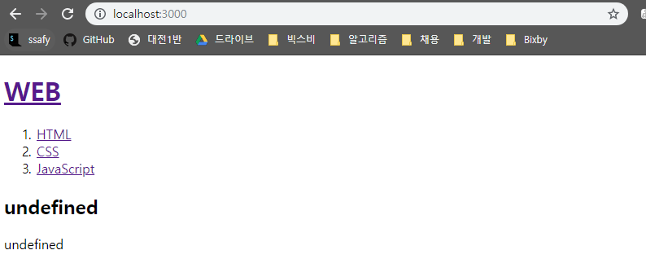

# 1. Not Found 오류 페이지 구현

#### 1-1. 기존 코드에서 마음에 들지 않는건 없애버리고 시작하자 :)

```javascript
var http = require('http');
var fs = require('fs');
var url = require('url');

var app = http.createServer(function(request,response){
    var _url = request.url;
    var queryData = url.parse(_url, true).query;
    var title = queryData.id
    
    fs.readFile(`data/${title}`, 'utf-8', function(err, description) {
        var template = `
        <!doctype html>
        <html>
        <head>
          <title>WEB1 - ${title}</title>
          <meta charset="utf-8">
        </head>
        <body>
          <h1><a href="/">WEB</a></h1>
          <ol>
            <li><a href="/?id=HTML">HTML</a></li>
            <li><a href="/?id=CSS">CSS</a></li>
            <li><a href="/?id=JavaScript">JavaScript</a></li>
          </ol>
          <h2>${title}</h2>
          <p>${description}</p>
        </body>
        </html>
        `;
        response.end(template);
    })

});
app.listen(3000);
```

#### 1-2. 사용자가 Root로 접근했는지 안했는지 확인하기

* url을 파싱하면 어떤 정보가 담겨있는지 확인하기

  ```javascript
  var app = http.createServer(function(request,response){
      var _url = request.url;
      var queryData = url.parse(_url, true).query;
      var title = queryData.id
  
      console.log(url.parse(_url, true));
  ```

  * 우리가 만들고 있는 Node.js 애플리케이션은 query string을 통해 페이지에 접근하도록 구현했다.
    * path name을 통해 페이지에 접근하도록 구현한 것은 맨 처음에 /1.html, /2.html 과 같은 방식으로 접근했을 때를 의미한다.
      * path name = `/1.html `
    * 지금은 path name으로 접근하지 않고 /?id=HTML 과 같은 query string으로만 페이지에 접근하기 때문에 path name이 '/'라고 출력되는 것이 정상이다.
      * path name = `/`

#### 1-3. path name이 '/'가 아니면 Not Found 페이지를 출력하도록 만들어보자

* 사용자가 요청한 URL 주소의 path name이 '/'일 경우
  **pathname: '/'**

  ```
  http://localhost:3000/?id=HTML
  ```

  ```
  Url {
    protocol: null,
    slashes: null,
    auth: null,
    host: null,
    port: null,
    hostname: null,
    hash: null,
    search: '?id=HTML',
    query: [Object: null prototype] { id: 'HTML' },
    pathname: '/',
    path: '/?id=HTML',
    href: '/?id=HTML' }
  ```

* path name이 '/'가 아닐 경우
  **pathname: '/hello.html'**

  ```
  http://localhost:3000/hello.html
  ```

  ```
  Url {
    protocol: null,
    slashes: null,
    auth: null,
    host: null,
    port: null,
    hostname: null,
    hash: null,
    search: null,
    query: [Object: null prototype] {},
    pathname: '/hello.html',
    path: '/hello.html',
    href: '/hello.html' }
  ```


#### Not Found 페이지 구현 - 소스코드

```javascript
var app = http.createServer(function(request,response){
    var _url = request.url;
    var queryData = url.parse(_url, true).query;
    var pathname = url.parse(_url, true).pathname;
    
    // 1. 사용자가 path name을 사용하지 않고, query string으로만 잘 요청했을 경우
    if (pathname === '/') {
        fs.readFile(`data/${queryData.id}`, 'utf-8', function(err, description) {
          var title = queryData.id;
          var template = `
          <!doctype html>
          <html>
          <head>
            <title>WEB1 - ${title}</title>
            <meta charset="utf-8">
          </head>
          <body>
            <h1><a href="/">WEB</a></h1>
            <ol>
              <li><a href="/?id=HTML">HTML</a></li>
              <li><a href="/?id=CSS">CSS</a></li>
              <li><a href="/?id=JavaScript">JavaScript</a></li>
            </ol>
            <h2>${title}</h2>
            <p>${description}</p>
          </body>
          </html>
          `;
          // 잘 통신됐다는 의미로 200을 넘겨줌
          response.writeHead(200);
          response.end(template);
        });
      // 2. 사용자가 path name을 적었을 경우
      // 다시 한번 얘기하지만, 현재 우리의 목표는 path name을 적지 않고
      // query string으로만 접근하는 것이기 때문에 path name이 무조건 '/'으로 나와야한다.
      } else {
      // 페이지를 찾을 수 없다는 의미로 404를 넘겨줌
      response.writeHead(404);
      response.end('Not found!');    
    }
});
app.listen(3000);
```


# 2. 홈페이지 구현 (App)

> undefined로 뜨고있는 home을 처리해보자




* 홈으로 갔을 때도 pathname이 /이며, CSS와 같은 페이지로 갔을 때도 특별한 경로가 붙어있지 않기때문에 pathname이 /다. 현재 상황으로선 홈과 각각의 페이지를 구분할 수 없으므로, 반복문을 중첩사용하여 이 둘을 구분해보자.
  * pathname이 '/'인 경우 : path name을 적지 않았다는 의미
    `if (pathname === '/')`
    * pathname이 '/'이지만 query string이 비어있어서 `undefined`가 들어온 경우 **(Home 화면 접근)**
      `if (queryData.id === undefined)`
    * pathname이 '/'이고 query string에 CSS, HTML과 같은 다른 값들이 들어온 경우 **(페이지 접근)**
      `else`
  * pathanme이 '/'가 아닌 경우 : path name을 적었다는 의미
    `else`
    * Not Found 출력


#### 소스코드

```javascript
var http = require('http');
var fs = require('fs');
var url = require('url');

var app = http.createServer(function(request,response){
    var _url = request.url;
    var queryData = url.parse(_url, true).query;
    var pathname = url.parse(_url, true).pathname;
    // console.log(pathname)
    console.log(url.parse(_url, true))
    // 1. pathname이 '/'일 경우
    if (pathname === '/') {
      // 1-1. query string을 분석했는데 undefined일 경우 (Home)
      if (queryData.id === undefined) {
        // console.log(queryData.id)
        //=> undefined
          var title = 'Welcome';
          var description = 'Hello, Node.js';
          var template = `
          <!doctype html>
          <html>
          <head>
            <title>WEB1 - ${title}</title>
            <meta charset="utf-8">
          </head>
          <body>
            <h1><a href="/">WEB</a></h1>
            <ol>
              <li><a href="/?id=HTML">HTML</a></li>
              <li><a href="/?id=CSS">CSS</a></li>
              <li><a href="/?id=JavaScript">JavaScript</a></li>
            </ol>
            <h2>${title}</h2>
            <p>${description}</p>
          </body>
          </html>
          `;
          // 잘 통신됐다는 의미로 200을 넘겨줌
          response.writeHead(200);
          response.end(template);
      // 1-2. query string을 분석했는데 값이 넘어왔을 경우
      } else {
        // console.log(queryData.id)
        //=> CSS, JavaScript, HTML
        fs.readFile(`data/${queryData.id}`, 'utf-8', function(err, description) {
          var title = queryData.id;
          var template = `
          <!doctype html>
          <html>
          <head>
            <title>WEB1 - ${title}</title>
            <meta charset="utf-8">
          </head>
          <body>
            <h1><a href="/">WEB</a></h1>
            <ol>
              <li><a href="/?id=HTML">HTML</a></li>
              <li><a href="/?id=CSS">CSS</a></li>
              <li><a href="/?id=JavaScript">JavaScript</a></li>
            </ol>
            <h2>${title}</h2>
            <p>${description}</p>
          </body>
          </html>
          `;
          // 잘 통신됐다는 의미로 200을 넘겨줌
          response.writeHead(200);
          response.end(template);
        });
      }
    // 2. pathname이 '/'이 아닐 경우
    } else {
      // 페이지를 찾을 수 없다는 의미로 404를 넘겨줌
      response.writeHead(404);
      response.end('Not found!');    
    }
});
app.listen(3000);
```


