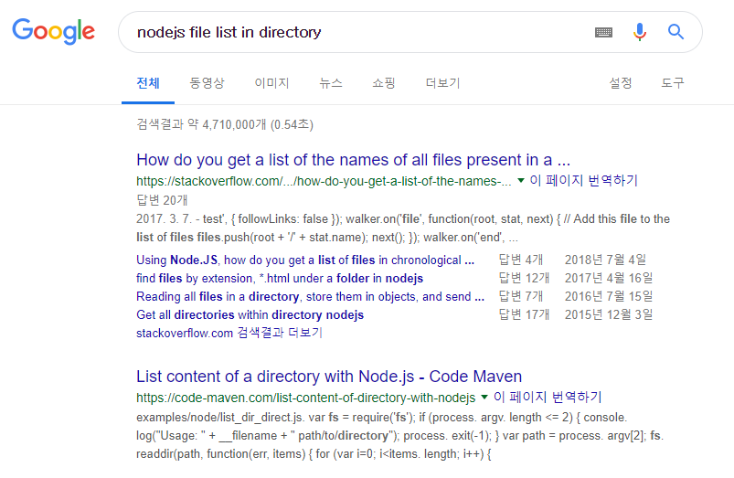
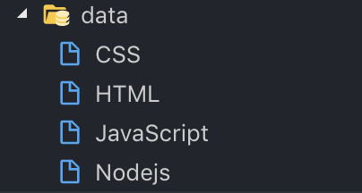
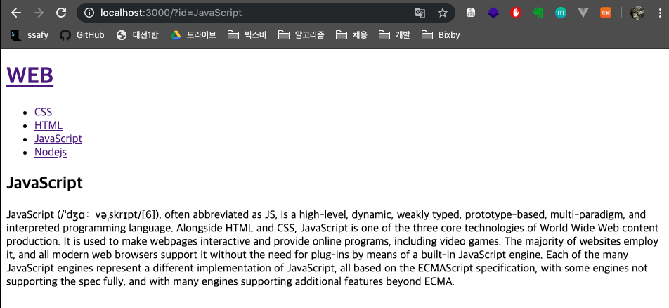

# 1. 파일 목록 알아내기 - Node.js

> 특정 디렉토리 하위에 있는 파일과 디렉토리의 목록을 알아내는 방법

* data 폴더 하위에 있는 파일들이 사라지거나 추가될 때 node js를 통해 알아낼 수 있을까?
  

* nodejs 폴더에 readdir.js 파일을 생성한다.

  ```javascript
  // node가 실행되는 폴더를 기준으로 경로를 설정한다.
  const testFolder = './data';  
  // File System 모듈을 불러온다.
  const fs = require('fs');
  
  // function의 파라미터의 이름은 마음대로 해도 좋으나 순서는 반드시 지키자.
  fs.readdir(testFolder, function(error, fileList) {
      console.log(fileList);
  });
  ```

* readdir.js 파일을 실행시켜서 결과값을 확인한다.
  결과값을 배열 형태로 돌려준다.

  ```bash
  $ node nodejs/readdir.js
  [ 'CSS', 'HTML', 'JavaScript' ]
  ```

* 앞으로 위와 같이 **배열 형태로 받은 값을 반복문을 통해 어떠한 결과물을 만들어낼 것**이다.


# 2. 글 목록 출력하기 - App

> data 폴더에 있는 파일들을 불러옴으로써, 데이터가 변경될 시 자동으로 리스트를 바꿀 수 있도록 만든다.

```javascript
var app = http.createServer(function(request,response){
    var _url = request.url;
    var queryData = url.parse(_url, true).query;
    var pathname = url.parse(_url, true).pathname;

    if (pathname === '/') {
      // 1. 사용자가 홈 화면을 요청했을 경우
      if (queryData.id === undefined) {
        fs.readdir('./data', function(error, fileList) {
          // console.log(fileList)
          //=> [ 'CSS', 'HTML', 'JavaScript' ]
          var title = 'Welcome';
          var description = 'Hello, Node.js';
          
          // list라는 변수에 내가 원하는 HTML 코드를 작성한다.
          var list = '<ul>';	// 시작은 ul 여는태그
          var i = 0;
          // i가 fileList의 크기보다 작으면 반복문을 수행한다.
          // fileList의 i번째 id값을 불러와서 list변수에 <li>태그를 추가해준다.
          while(i < fileList.length) {
            list += `<li><a href="/?id=${fileList[i]}">${fileList[i]}</a></li>`
            i += 1;
          }
          list += '</ul>'			// 마지막은 ul 닫는태그
          var template = `
          <!doctype html>
          <html>
          <head>
            <title>WEB1 - ${title}</title>
            <meta charset="utf-8">
          </head>
          <body>
            <h1><a href="/">WEB</a></h1>
            ${list}
            <h2>${title}</h2>
            <p>${description}</p>
          </body>
          </html>
          `;
          response.writeHead(200);
          response.end(template);
        })
			
      // 2. 사용자가 각 상세페이지를 요청했을 경우
      } else {
        // 2-1. 상세페이지에 사용될 바로가기 링크를 만드는 코드
        fs.readdir('./data', function(error, fileList) {
          var list = '<ul>';
          var i = 0;
          while(i < fileList.length) {
            list += `<li><a href="/?id=${fileList[i]}">${fileList[i]}</a></li>`
            i += 1;
          }
          list += '</ul>'
        // 2-2. 상세페이지에 사용될 본문 내용을 만드는 코드
        fs.readFile(`data/${queryData.id}`, 'utf-8', function(err, description) {
          var title = queryData.id;
          var template = `
          <!doctype html>
          <html>
          <head>
            <title>WEB1 - ${title}</title>
            <meta charset="utf-8">
          </head>
          <body>
            <h1><a href="/">WEB</a></h1>
            ${list}
            <h2>${title}</h2>
            <p>${description}</p>
          </body>
          </html>
          `;
          response.writeHead(200);
          response.end(template);
        });
      });
      }
    } else {
      response.writeHead(404);
      response.end('Not found!');    
    }
});
app.listen(3000);
```


### 출력결과

* data 폴더에 Nodejs라는 임의의 파일을 작성해서 추가한다.

  

* 다른 코드를 건들지 않고도 웹 페이지에 자동으로 추가됐다.

  