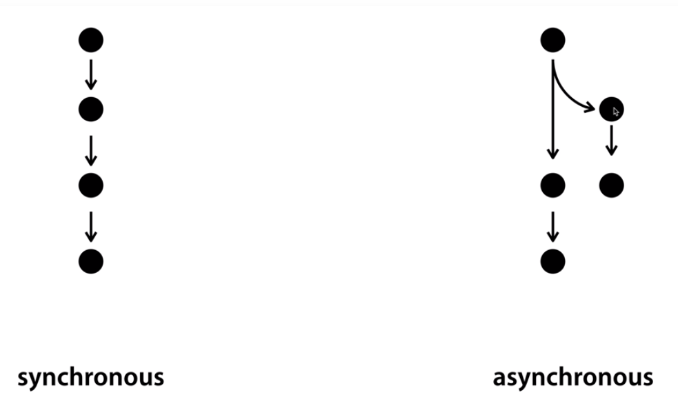

# Node.js의 동기와 비동기

> [Node.js 공식문서](<https://nodejs.org/api/fs.html>) File System에 있는 여러가지 메소드들을 보면 뒤에 Sync라고 붙어있는 메소드들을 확인할 수 있다.
>
> Node.js의 성능을 극대화하기 위해선 비동기적인 방식으로 작업을 해야한다. 다만 너무 코드가 복잡하고, 대단한 성능이 필요한게 아니면 심플하고 이해하기 쉬운 동기적인 처리를 하는 것도 잘못된 선택은 아니다.



* readFile() 메소드를 기준으로 보면, 그냥 readFile 메소드는 callback 함수가 있고 readFileSync 메소드는 callback 함수가 없는 것을 확인할 수 있다. 이를 통해 둘의 차이점을 파악해보자.
  * fs.readFile(path[, options], callback)
  * fs.readFileSync(path[, options])


####  `readFileSync(path[, options])` : 동기적인 처리

* Sync 메소드는 return 값을 주기 때문에 result라는 변수에 담아서 사용한다.

```javascript
// syntax/sync.js

var fs = require('fs');

// readFileSync
console.log('A');
var result = fs.readFileSync('syntax/sample.txt', 'utf8');
console.log(result);
console.log('C');
```

```
A
B
C
```


### `readFile(path[, options], callback)` : 비동기적인 처리

* readFile 메소드는 리턴값이 아니기 때문에 변수에 담지 않고, 함수를 3번째 인자로 넘겨주면 된다.

```javascript
console.log('A');
fs.readFile('syntax/sample.txt', 'utf8', function(err, result) {
    console.log(result);
});
console.log('C');
```

```
A
C
B
```


# Callback

### 위에서 작성한 readFile()의 의미를 해석해보자

* 코드

  ```javascript
  fs.readFile('syntax/sample.txt', 'utf8', function(err, result) {
      console.log(result);
  });
  ```

* 해석

  * Node.js야 니가 갖고있는 readFile 기능을 이용해서 'syntax/sample.txt' 파일을 읽어와!
    근데 시간이 좀 걸리니까, 작업이 끝난 다음에 내가 너한테 전달해준 세번째 인자인 함수를 실행시켜 ^^


### Callback 함수 써보기

* 함수의 이름이 붙여져 있지 않은 함수를 '익명함수'라고 한다.
  익명함수를 호출하기 위해 이 함수를 임의의 변수에 담아준다.
  a라는 변수의 '값'으로서 함수를 정의하고 있다. 이는 자바스크립트에서는 함수가 값이라는 것을 의미한다.

```javascript
var a = function() {
  console.log('A');
}

function slowfunc(callback) {
    callback();
}

slowfunc(a);
```

```
A
```

