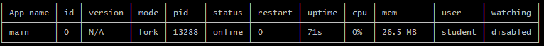
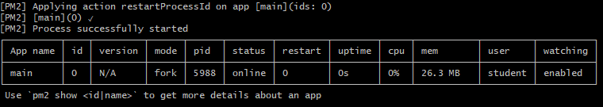

# 패키지 매니저와 PM2

> 혼자서 소프트웨어를 만드는 일은 거의 없다. 타인의 모듈을 이용해서 소프트웨어를 만들게 된다.
> 이때 사용하는 모듈이 많아지면 여러가지 복잡한 문제가 생겨난다. 이를 관리하는 도구가 패키지 매니저다.
> 대표적인 패키지 매니저인 NPM에 대해 알아보자.
>
> 또한 Node.js 애플리케이션을 관리하는 프로세스 매니저 PM2의 사용법도 알아보자.


## 1. 패키지 매니저 - NPM

> 소프트웨어에서 사용하고 있는 모듈을 관리하는 도구
>
> 독립적으로 실행되는 프로그램도 패키지, 어느 프로그램에서 조그만 부품으로 사용되는 프로그램도 패키지라고 말할 수 있다. 이러한 소프트웨어들을 생성, 설치, 업데이트, 삭제 등 관리해주는 프로그램을 패키지 매니저라고 한다.
>
> NPM은 Node.js 설치할 때 함께 설치된 패키지 매니저다.


## 2. [PM2](<http://pm2.keymetrics.io/>)

> 실행 중인 Node.js 애플리케이션을 관리하는 프로세스 매니저

* 간단하게 설치해보자 :)

  ```bash
  $ npm install pm2 -g
  ```

* 우리 애플리케이션을 실행시켜보자

  ```bash
  $ pm2 start main.js
  ```

  

* 각종 PM2 명령어들

  * Monitoring

    ```bash
    $ pm2 monit
    ```

  * Microservice

    ```bash
    $ pm2 list
    $ pm2 stop
    $ pm2 restart
    $ pm2 delete
    ```

* `$ pm2 start main.js --watch`

  

  * watch 명령어를 통해 애플리케이션을 실행할 경우
    PM2가 자동으로 main.js의 소스코드 변경을 감지하고 서버를 껐다 켜주기 때문에,
    새로고침만 하면 바로 반영되어있는 것을 확인할 수 있다.

* `$ pm2 log`

  * watch 명령어를 통해 실행하면 이전에 바로바로 뜨던 에러들이 콘솔창에 뜨지 않는데,
    log 명령어를 통해 확인하면 변경사항 혹은 에러내용을 쉽게 확인할 수 있다.