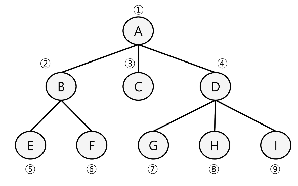

# 190227 알고리즘 BFS

* #### BFS (너비우선탐색)

  * 너비우선탐색은 탐색 시작점의 인접한 정점들을 먼저 모두 차례로 방문한 후에, 방문했던 정점을 시작점으로 하여 다시 인접한 정점들을 차례로 방문하는 방식
  * 인접한 정점들에 대해 탐색을 한 후, 차례로 다시 너비우선탐색을 진행해야하므로, 선입선출 형태의 자료구조인 큐를 활용함

